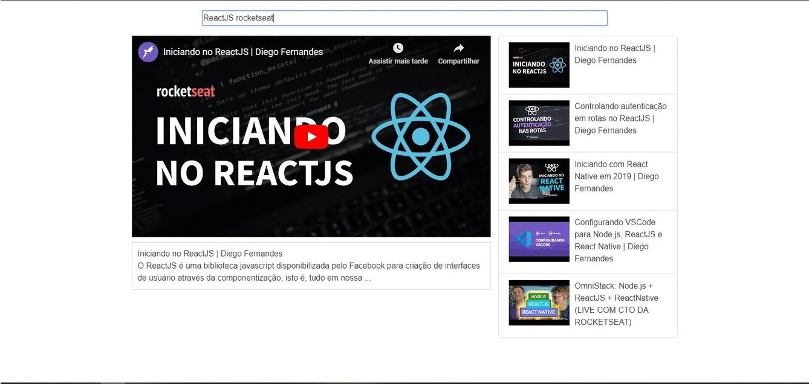

# MiniYoutube-ReactJS

O MiniYoutube é um aplicativo do ReactJS que busca vídeos da API do youtube. O usuário pode reproduzir qualquer vídeo e pesquisar mais vídeos. O aplicativo possui uma barra de pesquisa dinâmica que retorna o resultado ao alterar o termo de pesquisa.

## Características

- [x] Reproduzir Videos
- [x] Listar Videos
- [x] Procurar Videos

## Requerimentos

- NodeJS
- ReactJS

## Instalação

#### Manual

1. Clone ou Download
2. npm install
3. npm start
4. IR à localhost:8080/
